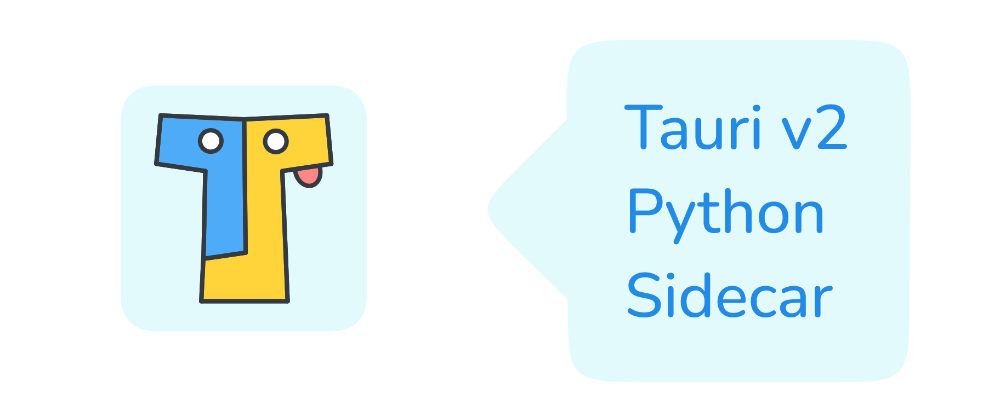
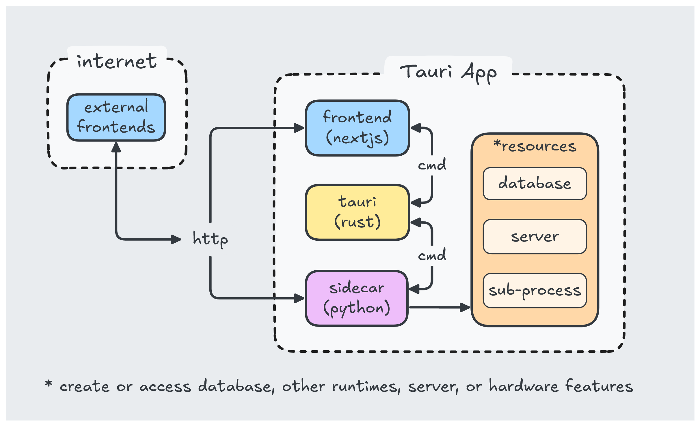

# Example Tauri v2 app using Python sidecar

A native app built with Tauri version 2 that spawns a Python sub-process (sidecar) which starts a FastAPI server.



## Introduction

The example app uses Next.js as the frontend and Python (FastAPI) as the backend. Tauri is a Rust framework that orchestrates the frontend and backend(s) into a native app experience.

This template project is intended to demonstrate the use of single file Python executables with Tauri v2.


The use of "sidecars" is to allow developers to package dependencies to make installation easier on the user. Tauri allows the frontend to communicate with any runtime and gives access to the OS's disk, camera, and other native hardware features. This is defined in the `tauri.conf.json` file. See [here](https://v2.tauri.app/develop/sidecar/) for more info.

## How It Works



- Tauri takes your frontend UI written in html/javascript and displays it in a native webview. This makes the resulting file size smaller since it does not need to include a web browser.

- [PyInstaller](https://pyinstaller.org/en/stable/) is used to compile a binary of the Python code so users don't have to worry about installing dependencies.

- In `main.rs` we spawn a python binary ("sidecar") called `main.exe` which starts an api server on `localhost:8008`. The frontend tells Tauri to startup and shutdown the sidecar via stdin/stdout commands (cannot use process.kill() for one-file Python executables since Tauri only knows the pid of the PyInstaller bootloader process and not its' child process which is actually the sidecar).

- If you are not comfortable coding in Rust, do not worry, this example orchestrates things in a way so you only need concern yourself with communication between your frontend and server (sidecar) via http.

- When the GUI window is closed, the server and python processes are shutdown properly.

## Features

This should give you everything you need to build a local, native application that can use other programs to perform specialized work (like a server, llm engine or database).

- Launch and communicate with any binary or runtime written in any language. This example uses a single Python executable.

- Communicate between frontend (javascript) and a spawned server via http.

- IPC communication between frontend (javascript) and Tauri (Rust) framework.

- Also control this app from an external UI source like another website. As long as it uses http(s) and you whitelist the url in the server config `main.py`.

## Project Structure

These are the important project folders to understand.

```bash
/app # (frontend code, js/html/css)
/src/backends # (backend code, the "sidecar")
/src-tauri
  |  /bin/api # (compiled sidecar is put here)
  |  /icons # (app icons go here)
  |  /src/main.rs # (Tauri main app logic)
  |  tauri.conf.json # (Tauri config file for app permissions, etc.)
package.json # (build scripts)
```

## Getting Started

### Dependencies

Install all dependencies for javascript and Python:

```bash
pnpm install-reqs
```

Or install javascript dependencies only:

```bash
pnpm install
```

Or install dependencies for Python only. Be sure to run with admin privileges. Recommend creating a virtual env:

```
pip install -r requirements.txt
```

Tauri requires icons in the appropriate folder. Run the script to automatically generate icons from a source image. I have included icons for convenience.

```bash
pnpm build:icons
```

### Run

Run the app in development mode:

```bash
pnpm tauri dev
```

### Build

#### Compile python sidecar

Run this at least once before running `pnpm tauri dev` and each time you make changes to your python code. This command is also called by `pnpm tauri build`:

```bash
pnpm build:sidecar-winos
# OR
pnpm build:sidecar-macos
# OR
pnpm build:sidecar-linux
```

In case you dont have PyInstaller installed run:

```
pip install -U pyinstaller
```

A note on compiling Python exe (the -F flag bundles everything into one .exe). You won't need to run this manually each build, I have included it in the build scripts.

---

#### Build for production

Build the production app for a specific OS:

```bash
pnpm tauri build
```

This creates an installer located here:

- `<project-dir>\src-tauri\target\release\bundle\nsis`

And the raw executable here:

- `<project-dir>\src-tauri\target\release`

## Todo's

- Pass parameters to the sidecar (like server port) via a frontend form.

- Pass argument `--dev-sidecar` to `pnpm tauri dev` script that tells Tauri to run sidecars in "dev mode". This would allow for running the python code from the python interpreter installed on your machine rather than having to manually run `pnpm build:sidecar-[os]` each time you make changes to the Python code.

- Develop a standalone multi-sidecar manager that can handle startup/shutdown and communication between all other sidecars spawned in the app.

## Learn More

- [Tauri Framework](https://tauri.app/) - learn about native app development in javascript and rust.
- [NextJS](https://nextjs.org/docs) - learn about the popular react framework Next.js
- [FastAPI](https://fastapi.tiangolo.com/) - learn about FastAPI server features and API.
- [PyInstaller](https://pyinstaller.org/en/stable/) - learn about packaging python code.
